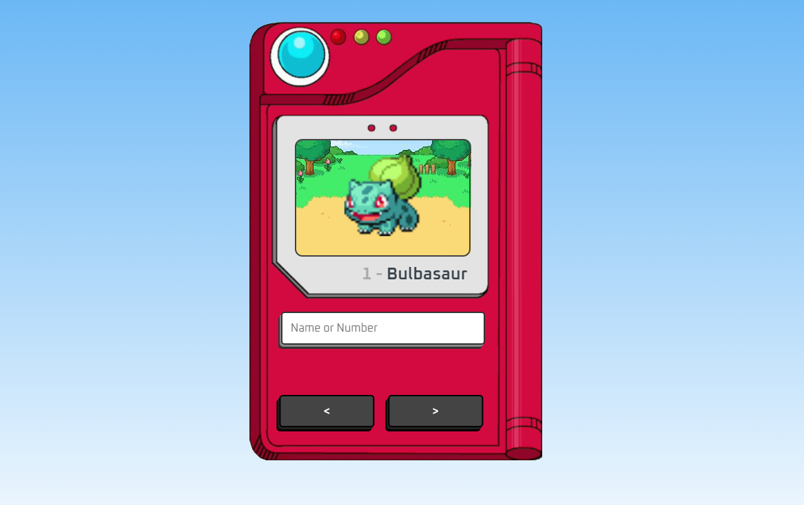
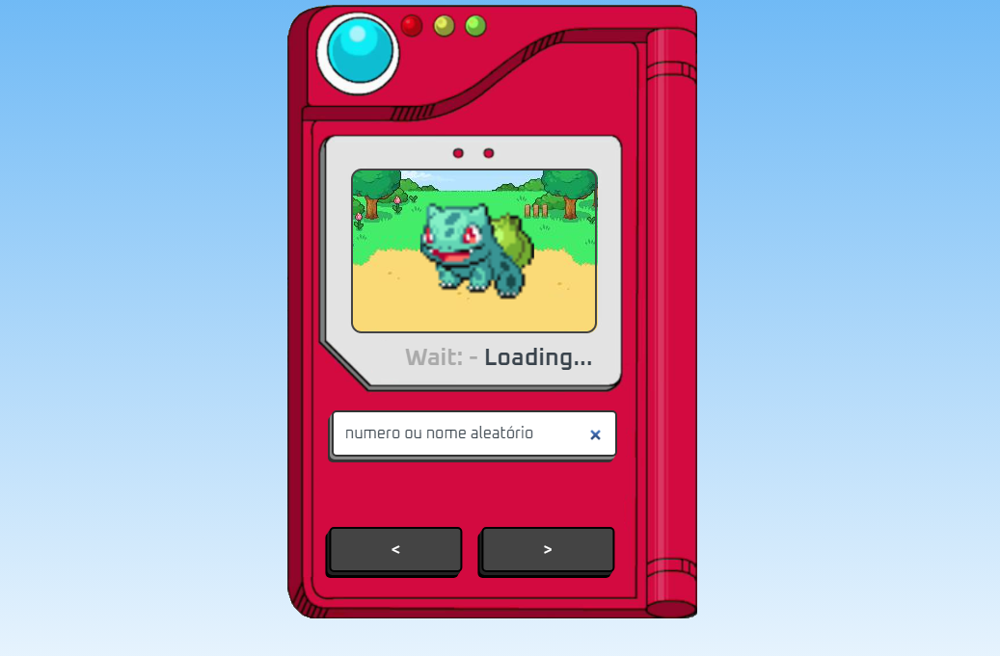
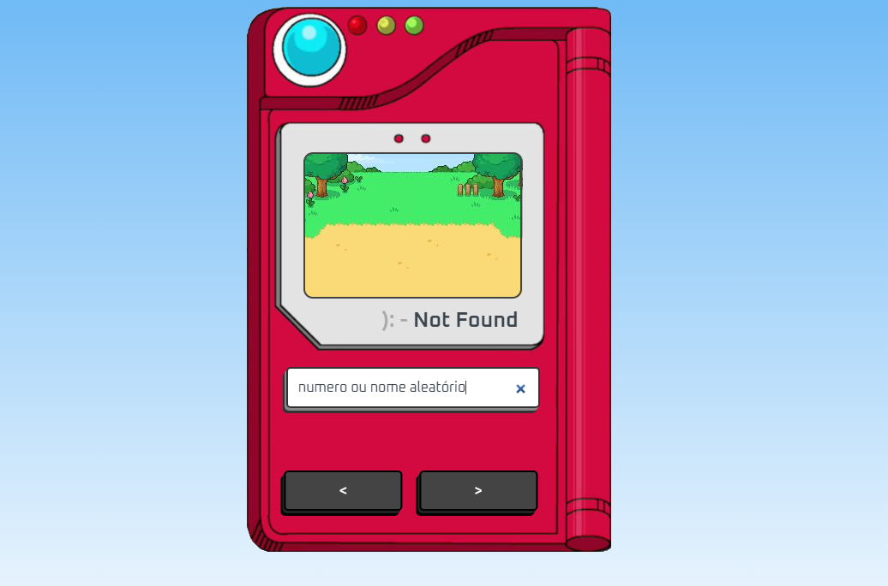

  
  
  
   
  

# Pokedex Project

<h4 align="center"> 
	🚜🚧 Completed Project 🚜🚧
</h4>

 <a href="#about">About</a> •
 <a href="#installation">Installation</a> • 
 <a href="#author">Author</a> • 
  <a href="#license">License</a> • 
 <a href="#readme">README</a>

## About

### About the project

The aim of the project is to bring together something I like (Pokemon) and put my JS studies into practice by feeding and manipulating a project with an API. The project was carried out according to the tutorial on the [Manual do DEV] channel (https://www.youtube.com/@ManualdoDev) in the video: [Como criar uma Pokedex com HTML, CSS e JavaScript](https://youtu.be/SjtdH3dWLa8?si=QvHw7lLvQ1hcX3bN), and I also consulted and referenced the [MDN Webdocs](https://developer.mozilla.org/pt-BR/docs/Web/JavaScript) website for the content I felt was relevant for a better understanding, especially with regard to Fetch and other questions that arose during the course of the project.

### Visualize the project!

 This is the image of the project when you open it for the first time

Here are some of the other ways the project can present itself, such as when you search for a Pokemon's number or name, it will load until it finds it, or it will signal when it has an error.

## Installation

- You can view the project and the lines of code via [CODEPEN](https://codepen.io/marelps/pen/RwXjXpL)
- You can also view it by deploying the project from [vercel](https://pokedex-tau-inky.vercel.app/)

To install the project locally, you can clone the repository via HTTPS, SSH and GitHub CLI.

1. Open Git Bash. 
4. Change the current working directory to the location where you want to have the directory cloned.
5. Type git clone and paste the URL already copied. 

~~~git
$ git clone https://github.com/marelps/pokedex.git
~~~

## Author

 
  
 <b>Vitória Garrucho</b>  Made with ❤️

Contact me through my social! 

 

## License

This project is under license [MIT](./LICENSE).

Made with ❤️ by Vitória Garrucho

<a href="https://www.linkedin.com/in/vitoriagarrucho/" target="_blank">Contact me!</a>

## README

[Português](./README.md) | [English](./README-en.md)
